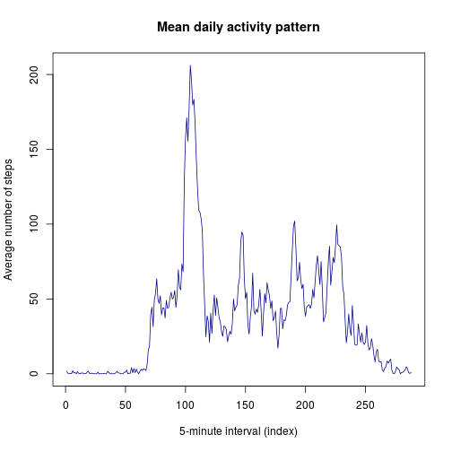
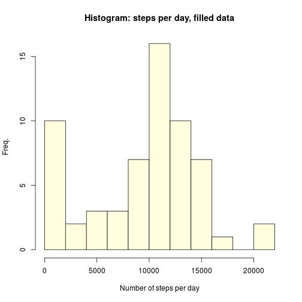
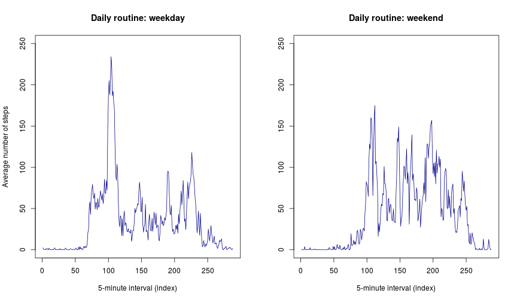

Coursera Reproducible Research Project 1
-------------------------------------------
**Introduction**  
The following is a brief exploratory data analysis of a dataset collected using acticity monitoring devices such as Fitbit, Jawbone etc. 

**Preparing the data**  
The first step is to download and unzip the data file and produce a data frame, as follows.

```r
download.file("https://d396qusza40orc.cloudfront.net/repdata%2Fdata%2Factivity.zip",
    destfile="activitydata.zip",method="curl")
unzip("activitydata.zip")
actdata<-read.csv("activity.csv")
```
**Question 1: Number of steps taken each day**  
To explore the average number of steps taken per day, a new vector of values is calculated using tapply.


```r
steps.day<-tapply(actdata$steps,actdata$date,sum,na.rm=TRUE)
summary(steps.day,digits=c(4,4,5,4,4,4))
```

```
##    Min. 1st Qu.  Median    Mean 3rd Qu.    Max. 
##       0    6778   10395    9354   12810   21190
```

The summary data show that the mean number of steps per day was 9354 and the median number of steps was 10395. This suggests that the distribution is negatively skewed, and this is  illustrated by the histogram below.


```r
hist(steps.day,xlab="Number of steps per day",ylab="Freq.",
    main="Histogram: steps per day",breaks=10,col="lightyellow")
```

 

This shows a number of zero values, likely due to missing values in the data set (see later)

**Question 2: The daily routine**  
The time series plot below shows the daily routine in terms of the average number of steps per five minute interval (the x-axis shows the index number of the interval). 

```r
routine<-tapply(actdata$steps,actdata$interval,mean,na.rm=TRUE)
plot(routine,type="l",ylab="Average number of steps",
    xlab="5-minute interval (index)",main="Mean daily activity pattern",
    col="darkblue")
```

 


```r
which(routine==max(routine))
```

```
## 835 
## 104
```

```r
max(routine)
```

```
## [1] 206.1698
```

The most active 5 minute interval of the day is index 104 (08:35 to 08:40), which averages 206 steps across the observed days.

**Question 3: Removing NA values**  
To explore whether missing values have a significant distorting effect on the data, the number of steps per day is recalculated, replacing all NA values in the data with the median value for the 5-minute interval to which it belongs.


```r
index<-which(is.na(actdata$steps))
actdata.noNA<-actdata
for (i in index) {
    currentinterval<-actdata$interval[i]
    newvalue<-median(actdata$steps[actdata$interval==currentinterval],na.rm=TRUE)
    actdata.noNA$steps[i]<-newvalue
}
steps.day.2<-tapply(actdata.noNA$steps,actdata.noNA$date,sum)
```

The histogram of the corrected data is shown below.

```r
hist(steps.day.2,xlab="Number of steps per day",ylab="Freq.",
    main="Histogram: steps per day, filled data",breaks=10,col="lightyellow")
```

 

Summary information for the data is as follows:


```r
summary (steps.day.2,digits=c(4,4,5,4,4,4))
```

```
##    Min. 1st Qu.  Median    Mean 3rd Qu.    Max. 
##      41    6778   10395    9504   12810   21190
```

This shows that the summary values have not changed dramatically, though the zero values have disappeared and the mean has increased slightly.

**Question 4: Comparing weekday vs weekend**  
In order to compare daily weekday and weekend routines, the date field was recoded from a factor to a date format and the weekdays function used to assign a new variable showing whether the day falls on a weekday or a weekend.


```r
actdata$date<-strptime(as.character(actdata$date),format="%F")
actdata$day<-weekdays(actdata$date)
actdata$weekday<-rep("weekday",nrow(actdata))
actdata$weekday[actdata$day=="Saturday"|actdata$day=="Sunday"]<-"weekend"
```

The mean activity per 5-minute interval was calculated again, first conditioning on whether the day was a weekday or weekend.


```r
routine.weekday<-with(subset(actdata,actdata$weekday=="weekday"),
    tapply(steps,interval,mean,na.rm=TRUE))
routine.weekend<-with(subset(actdata,actdata$weekday=="weekend"),
    tapply(steps,interval,mean,na.rm=TRUE))
```

Finally, plots were produced comparing the weekday and weekend routine. 


```r
# make the plots
par(mfrow=c(1,2))
plot(routine.weekday,type="l",col="darkblue",ylim=c(0,250),
    xlab="5-minute interval (index)",ylab="Average number of steps",
    main="Daily routine: weekday")
plot(routine.weekend,type="l",col="darkblue",ylim=c(0,250),
    xlab="5-minute interval (index)",ylab=NA,main="Daily routine: weekend")
```

 


